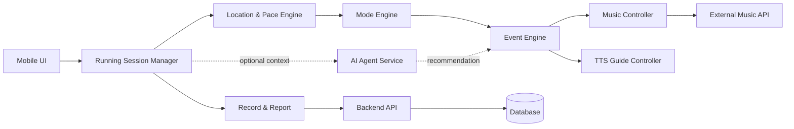
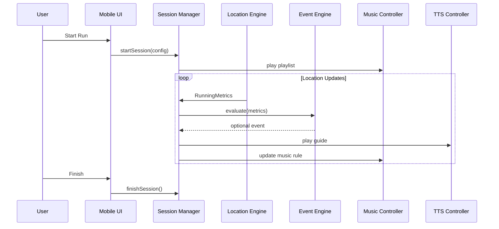

# Application Design — 엔터테인먼트형 러닝 앱

> 프로젝트명: TBD  
> 목적: 요구사항을 구현하기 위한 고수준 애플리케이션 구조 정의

## 1. Architecture Overview



### 설계 원칙
- GPS/Pace 계산과 이벤트 판정은 일반 코드로 처리
- 주요 TTS는 사전 생성/캐싱
- AI Agent는 추천·오케스트레이션·요약에 사용
- 음악 연동은 Adapter 패턴으로 외부 API 변경에 대응
- 실제 러닝 없이 테스트 가능한 Simulation/Mock 제공

---

# 2. Main Components

## C-01. Running Setup UI
### Responsibility
- 플레이리스트 선택
- 목표 거리/시간/페이스 입력
- 러닝 모드 선택
- TTS/랜덤 이벤트 설정

### Output
`RunningSessionConfig`

## C-02. Running Session Manager
### Responsibility
러닝 세션 전체 생명주기 관리

### States
`READY → RUNNING → PAUSED → RUNNING → FINISHED`

### Interface
```text
startSession(config)
pauseSession()
resumeSession()
finishSession()
getSessionState()
```

## C-03. Location & Pace Engine
### Inputs
- latitude / longitude
- timestamp
- accuracy
- optional native speed

### Outputs
```text
RunningMetrics {
  elapsedTime
  totalDistance
  currentPace
  smoothedPace
  averagePace
  gpsAccuracy
}
```

### Processing
위치 수신 → 정확도 검증 → 거리 계산 → jump 제거 → pace smoothing → metrics 전달

## C-04. Mode Engine
선택된 모드의 규칙을 활성화한다.

### BASIC
- 정기 기록 안내
- 기본 플레이리스트
- 랜덤 이벤트 낮은 빈도

### MARATHON
- 목표 페이스 비교
- 거리 milestone
- 후반부 boost

### INTERVAL
- work/recovery timer
- 구간별 음악 태그
- 전환 TTS

### NATIONAL_TEAM
- 스포츠 해설
- Ghost Runner
- 가상 순위
- 경쟁 이벤트 강화

## C-05. Event Engine
모든 러닝 이벤트를 중앙 관리한다.

### Event Sources
1. Time Event
2. Distance Event
3. Pace Event
4. Mode Event
5. Random Event
6. Mission Event
7. Finish Event

### Model
```text
RunningEvent {
  id
  type
  source
  priority
  timestamp
  cooldownKey
  payload
}
```

### Priority Example
1. Safety/Pause
2. Interval Transition
3. Finish/Final Boost
4. Distance Milestone
5. Pace
6. Random

## C-06. TTS Guide Controller
이벤트에 맞는 사전 제작 음성을 선택/재생한다.

```text
TtsAsset {
  id
  mode
  eventType
  tone
  fileUri
  duration
  weight
}
```

### Audio Flow
`Event → TTS 선택 → 음악 볼륨 낮춤 → 나레이션 → 음악 볼륨 복구`

동적 페이스 숫자는 OS TTS 또는 숫자 음성 조합 사용 가능.

## C-07. Music Controller
### Responsibility
- 플레이리스트 조회/선택/재생
- play/pause/next
- 음악 태그 기반 후보 선택
- 이벤트에 따라 다음 곡 큐 변경
- Audio Ducking

```text
TrackProfile {
  externalTrackId
  title
  artist
  tags[]
  bpm?
  energyLevel?
  isFavorite?
}
```

### MVP Tags
`normal`, `high-energy`, `recovery`, `love`, `dramatic`, `favorite`

### Adapter
```text
MusicProvider
 ├── SpotifyAdapter
 └── MockMusicAdapter
```

## C-08. Mission & Combo Engine
### Mission Types
- SPEED_BOOST
- PACE_KEEP
- LAST_SONG
- ONE_MORE_SONG

### Mission State
`IDLE → ACTIVE → SUCCESS | FAIL`

## C-09. Ghost Runner / Virtual Ranking
목표 페이스 기반 가상 라이벌을 계산한다.

```text
ghostDistance = targetSpeed × elapsedTime
gap = userDistance - ghostDistance
```

## C-10. Run Record & Report
```text
RunRecord {
  sessionId
  startedAt
  finishedAt
  mode
  target
  totalDistance
  elapsedTime
  averagePace
  bestPace
  events[]
  missions[]
  tracks[]
}
```

## C-11. AI Agent Service
### Recommended Uses
1. 러닝 전 추천 모드
2. 이벤트/미션 후보 조합
3. 종료 후 재미있는 한 줄 요약
4. 장기 개인화

### Not Responsible For
GPS 계산 / pace smoothing / 인터벌 타이밍 / 난수 / mission 판정 / safety guard

---

# 3. Core Data Models

```text
User {
  id
  nickname
  preferredGuideTone
  eventEnabled
}

RunningSessionConfig {
  playlistId
  mode
  targetDistance?
  targetDuration?
  targetPace?
  intervalConfig?
  randomEventEnabled
  guideTone
}

RunningMetrics {
  timestamp
  elapsedTimeSec
  totalDistanceMeter
  currentPaceSecPerKm
  smoothedPaceSecPerKm
  averagePaceSecPerKm
  gpsAccuracyMeter
}

RunningEvent {
  id
  sessionId
  type
  occurredAt
  result?
  metadata
}

TrackPlayLog {
  trackId
  startedAt
  endedAt
  averagePaceDuringTrack?
  eventType?
}
```

---

# 4. Main Sequence



## Random Event Flow
`Random Check → Cooldown 검증 → Event 생성 → TTS → Music Tag 변경 → EventLog 저장`

---

# 5. External Integrations

## Music Provider
후보: Spotify

필요 기능:
- Authentication
- User playlists
- Playback/queue control (가능 범위)
- Current track metadata

### Risk
외부 API 정책/요금제/재생 권한 제약 가능.

### Mitigation
`SpotifyAdapter`와 `MockMusicAdapter`를 분리한다.

## TTS Provider
후보:
- OpenAI TTS
- ElevenLabs
- CLOVA Voice
- OS Native TTS

### MVP Recommendation
1. 주요 문구 사전 생성
2. 앱 asset/object storage 저장
3. 러닝 중 파일 재생
4. 동적 숫자만 OS TTS 또는 조각 음성 조합

## Location
- Android: Fused Location Provider
- iOS: Core Location
- Cross-platform: 대응 플러그인

---

# 6. Suggested Backend Responsibilities

Backend 사용 시 예시:
```text
/api/users
/api/runs
/api/tts-assets
/api/event-config
/api/music-tags
/api/agent/recommend
```

짧은 프로젝트라면 **Local-first + 최소 Backend** 권장.

---

# 7. Error Handling

### GPS
- 권한 거부 → 안내
- accuracy 나쁨 → 데이터 제외/보류
- GPS 손실 → 마지막 안정 상태 + 상태 표시

### Music
- 인증 만료 → 재인증
- 재생 실패 → 기본 playlist 또는 Mock fallback
- 태그 후보 없음 → 일반 다음 곡

### TTS
- 파일 누락 → skip
- 이벤트 충돌 → priority 높은 것 선택
- 연속 반복 → cooldown

---

# 8. Testing Strategy

## Unit Test
- pace 계산
- smoothing
- 이벤트 확률/cooldown
- 인터벌 state transition
- mission 판정
- ghost runner gap
- report aggregation

## Integration Test
- Location → Event
- Event → TTS
- Event → Music
- Session → Record

## Simulation Test
실제 달리지 않고 테스트 가능한 Fake GPS/Pace 제공.

Example:
```text
0~60s   6'30"/km
60~120s 5'30"/km
120~150s 4'50"/km
```

---

# 9. Recommended MVP Screens
1. 시작/로그인
2. 러닝 설정
3. 플레이리스트 선택
4. 모드 선택
5. 러닝 진행
6. 미션/인터벌 Overlay
7. 종료 리포트
8. 기록 목록

---

# 10. Technical Decisions — TBD

| Decision | Candidate | Status |
|---|---|---|
| Mobile | Flutter / React Native / Android Native | TBD |
| Backend | Spring Boot / FastAPI / Serverless / None | TBD |
| DB | PostgreSQL / Firebase / SQLite | TBD |
| Music | Spotify + Mock Adapter | Candidate |
| TTS | Pre-generated + Native TTS | Recommended |
| AI Agent | OpenAI / Bedrock / etc. | TBD |
