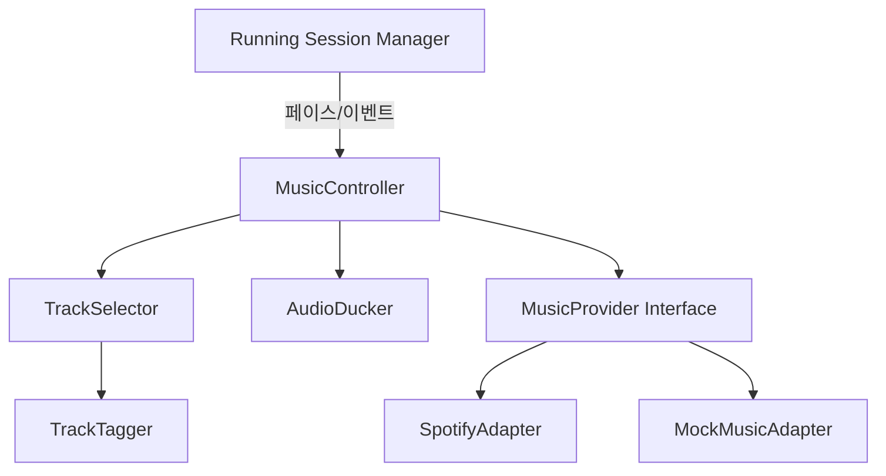
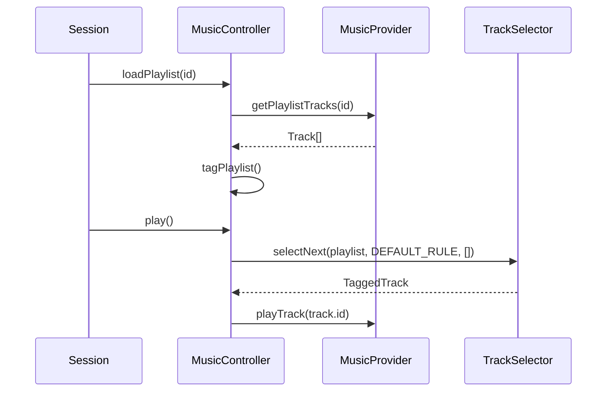
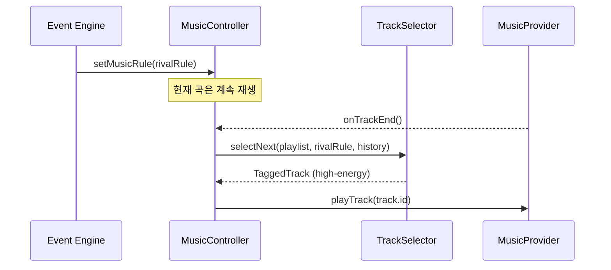
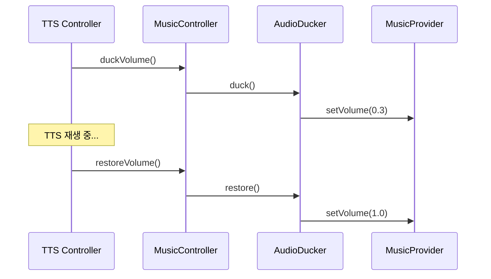

# Design — U3 Music Integration

> 목적: 요구사항(MU-01~MU-06)을 구현하기 위한 컴포넌트 구조, 인터페이스, 데이터 모델 설계

---

## 1. Architecture Overview



### 설계 원칙
- **Adapter 패턴**: 외부 음악 API 변경에 유연하게 대응
- **전략 패턴**: 선곡 규칙(MusicRule)을 교체 가능한 전략으로 분리
- **인터페이스 분리**: Provider/Controller/Selector 각 역할 명확 분리
- **테스트 용이성**: 모든 외부 의존성은 인터페이스 뒤에 숨김

---

## 2. Components

### C-MU-01. MusicController

음악 모듈의 진입점. 세션/이벤트와 음악 재생을 연결한다.

```typescript
interface MusicController {
  // 세션 연동
  loadPlaylist(playlistId: string): Promise<void>
  play(): void
  pause(): void
  resume(): void
  stop(): void
  next(): void

  // 상태
  getCurrentTrack(): Track | null
  getPlaybackState(): PlaybackState

  // 규칙 변경
  setMusicRule(rule: MusicRule): void
  clearMusicRule(): void

  // Audio Ducking
  duckVolume(): void
  restoreVolume(): void
}
```

#### 책임
- 플레이리스트 로드/재생 제어
- 곡 종료 시 TrackSelector에게 다음 곡 요청
- 이벤트/페이스에 따른 MusicRule 적용
- TTS 협력을 위한 볼륨 제어

---

### C-MU-02. TrackSelector

현재 활성 MusicRule과 태그를 기반으로 다음 곡을 선택한다.

```typescript
interface TrackSelector {
  selectNext(
    playlist: TaggedTrack[],
    currentRule: MusicRule,
    playHistory: string[]
  ): TaggedTrack
}
```

#### 선곡 알고리즘
```text
1. 현재 MusicRule에서 우선 태그 확인
2. 플레이리스트에서 해당 태그 후보 필터링
3. 최근 재생 이력 제외 (반복 방지)
4. 후보 중 랜덤 또는 순서 선택
5. 후보 없으면 → fallback: 일반 순서 재생
```

---

### C-MU-03. TrackTagger

트랙에 음악 태그를 부여한다.

```typescript
interface TrackTagger {
  tagTrack(track: Track): TaggedTrack
  tagPlaylist(tracks: Track[]): TaggedTrack[]
}
```

#### MVP 태깅 규칙
| 조건 | 태그 |
|---|---|
| BPM > 130 | `high-energy` |
| BPM 100~130 | `normal` |
| BPM < 100 | `recovery` |
| 장르: romance/ballad/love | `love` |
| 장르: epic/cinematic/orchestral | `dramatic` |
| 사용자 즐겨찾기 | `favorite` |
| 분류 불가 | `normal` (기본) |

#### BPM 획득 방식
1. 외부 API 메타데이터 (Spotify Audio Features 등)
2. 없으면 → `normal` 기본 분류

---

### C-MU-04. MusicRule

현재 음악 선곡 우선순위를 나타내는 값 객체.

```typescript
interface MusicRule {
  preferredTags: MusicTag[]   // 우선 태그 (순서대로)
  fallbackTag: MusicTag       // 후보 없을 때 기본
  source: string              // 규칙 발생 원인 (event/pace/mode)
  expiresAt?: number          // 만료 시각 (ms, optional)
}
```

#### 기본 규칙
```typescript
const DEFAULT_RULE: MusicRule = {
  preferredTags: ['normal'],
  fallbackTag: 'normal',
  source: 'default'
}
```

#### 이벤트별 규칙 예시
```typescript
// RIVAL_CHASING 이벤트 발생 시
const rivalRule: MusicRule = {
  preferredTags: ['high-energy', 'dramatic'],
  fallbackTag: 'normal',
  source: 'event:RIVAL_CHASING',
  expiresAt: Date.now() + 180_000  // 3분 후 만료
}
```

---

### C-MU-05. AudioDucker

TTS 재생 시 음악 볼륨을 조절한다.

```typescript
interface AudioDucker {
  duck(): void       // 볼륨 낮춤 (fade out to 30%)
  restore(): void    // 볼륨 복구 (fade in to 100%)
  isDucked(): boolean
}
```

#### 동작
- duck: 현재 볼륨 → 30%로 300ms fade
- restore: 30% → 원래 볼륨으로 300ms fade
- 중첩 호출 방지 (이미 ducked면 무시)

---

### C-MU-06. MusicProvider (Adapter Interface)

외부 음악 서비스와의 통신을 추상화한다.

```typescript
interface MusicProvider {
  // 인증
  authenticate(): Promise<AuthResult>
  isAuthenticated(): boolean

  // 플레이리스트
  getPlaylists(): Promise<Playlist[]>
  getPlaylistTracks(playlistId: string): Promise<Track[]>

  // 재생 제어
  playTrack(trackId: string): Promise<void>
  pause(): Promise<void>
  resume(): Promise<void>
  setVolume(level: number): Promise<void>  // 0.0 ~ 1.0

  // 메타데이터
  getTrackMetadata(trackId: string): Promise<TrackMetadata>

  // 이벤트
  onTrackEnd(callback: () => void): void
}
```

#### 구현체
- **SpotifyAdapter**: Spotify Web API / SDK 연동
- **MockMusicAdapter**: 테스트/데모용 가짜 재생 (타이머 기반)

---

## 3. Data Models

```typescript
// 음악 태그
type MusicTag = 'normal' | 'high-energy' | 'recovery' | 'love' | 'dramatic' | 'favorite'

// 재생 상태
type PlaybackState = 'idle' | 'playing' | 'paused' | 'loading'

// 트랙 기본 정보
interface Track {
  id: string
  title: string
  artist: string
  durationMs: number
  albumArt?: string
}

// 메타데이터 (외부 API에서 획득)
interface TrackMetadata {
  trackId: string
  bpm?: number
  genre?: string
  energy?: number        // 0.0 ~ 1.0
  valence?: number       // 0.0 ~ 1.0 (긍정도)
}

// 태그가 부여된 트랙
interface TaggedTrack extends Track {
  tags: MusicTag[]
  metadata?: TrackMetadata
}

// 플레이리스트
interface Playlist {
  id: string
  name: string
  trackCount: number
  imageUrl?: string
}

// 곡 재생 로그 (리포트용)
interface TrackPlayLog {
  trackId: string
  startedAt: number      // timestamp
  endedAt: number
  musicRule: MusicRule    // 재생 시점의 활성 규칙
  averagePaceDuringTrack?: number  // sec/km (U6 리포트용)
}
```

---

## 4. Sequence Diagrams

### 기본 재생 흐름



### 이벤트 기반 음악 전환



### Audio Ducking



---

## 5. State Management

### MusicController 상태

```typescript
interface MusicState {
  playbackState: PlaybackState
  currentTrack: TaggedTrack | null
  playlist: TaggedTrack[]
  playHistory: string[]         // 최근 재생 trackId 목록
  activeMusicRule: MusicRule
  isVolumeDucked: boolean
}
```

### 상태 전이

```text
idle → loading → playing ⇄ paused → idle
                    ↓
                 loading (next track)
```

---

## 6. Error Handling

| 상황 | 처리 |
|---|---|
| 인증 만료 | 재인증 시도 → 실패 시 Mock fallback |
| 트랙 재생 실패 | 다음 곡으로 skip |
| 메타데이터 없음 | `normal` 태그 기본 분류 |
| 태그 후보 없음 | fallback 순서 재생 |
| Provider 전체 장애 | 에러 표시 + 러닝은 계속 |
| 볼륨 제어 실패 | 무시 (음악 재생 유지) |

---

## 7. MockMusicAdapter 설계

테스트/데모용 가짜 음악 재생기.

```typescript
class MockMusicAdapter implements MusicProvider {
  // 사전 정의된 가짜 플레이리스트/트랙 반환
  // 재생은 타이머로 시뮬레이션 (30초 후 onTrackEnd 호출)
  // BPM/장르는 랜덤 or 고정값 제공
}
```

### Mock 데이터 예시
```typescript
const MOCK_TRACKS: Track[] = [
  { id: 'm1', title: '달려라', artist: 'Runner', durationMs: 180000 },
  { id: 'm2', title: 'Love Song', artist: 'Heart', durationMs: 240000 },
  { id: 'm3', title: 'Sprint!', artist: 'Fast', durationMs: 150000 },
  { id: 'm4', title: 'Chill Wave', artist: 'Slow', durationMs: 200000 },
  { id: 'm5', title: 'Final Boss', artist: 'Epic', durationMs: 210000 },
]
```

---

## 8. 외부 연동 설계

### Spotify 연동 (MVP 후보)

| 기능 | API |
|---|---|
| 인증 | OAuth 2.0 PKCE |
| 플레이리스트 목록 | GET /me/playlists |
| 트랙 목록 | GET /playlists/{id}/tracks |
| 재생 제어 | PUT /me/player/play |
| Audio Features (BPM) | GET /audio-features/{id} |

### 제약 및 대응
- Spotify Premium 필요 (재생 제어)
- Rate limit → 캐싱
- SDK 사용 시 foreground 제약 → Background 처리 검토 필요

---

## 9. 디렉토리 구조 (예상)

```text
src/
├── music/
│   ├── MusicController.ts
│   ├── TrackSelector.ts
│   ├── TrackTagger.ts
│   ├── AudioDucker.ts
│   ├── MusicRule.ts
│   ├── types.ts              # 공통 타입/인터페이스
│   ├── providers/
│   │   ├── MusicProvider.ts  # 인터페이스
│   │   ├── SpotifyAdapter.ts
│   │   └── MockMusicAdapter.ts
│   └── __tests__/
│       ├── TrackSelector.test.ts
│       ├── TrackTagger.test.ts
│       └── MusicController.test.ts
```

---

## 10. Technical Decisions

| 항목 | 결정 | 이유 |
|---|---|---|
| Provider 패턴 | Adapter + Interface | 외부 API 교체 용이, Mock 테스트 |
| 선곡 방식 | Tag 기반 필터 + 랜덤 | 단순하면서 상황 반응 가능 |
| 볼륨 제어 | Fade 300ms | 급격한 변화 방지 |
| 곡 전환 시점 | 현재 곡 끝난 후 | 사용자 경험 보호 |
| BPM 분류 기준 | 130/100 | 러닝 관련 연구 기반 일반적 기준 |
| 규칙 만료 | expiresAt timestamp | 이벤트 효과 자동 해제 |
